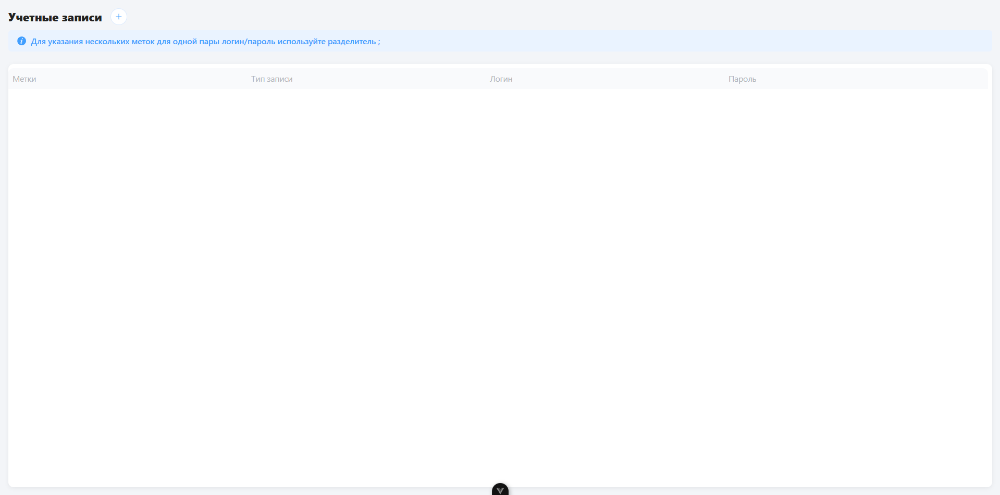
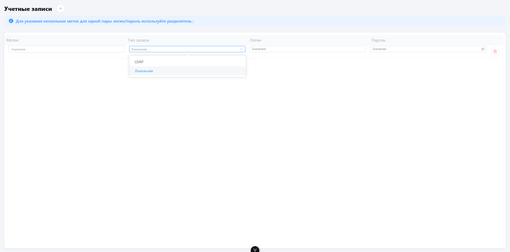

# SaaSoft

## Описание

**SaaSoft** — это современное веб-приложение для управления учётными записями пользователей.
Проект реализован на Vue 3 с использованием TypeScript, Element Plus и Pinia.
Интерфейс интуитивно понятен, поддерживает работу с несколькими аккаунтами, валидацию данных и удобное добавление/удаление записей.

---

## Основные возможности

- **Добавление, редактирование и удаление учётных записей**
- **Многострочные метки** с автоматическим переносом строк
- **Валидация полей** (ограничения по длине, обязательные поля)
- **Поддержка двух типов аккаунтов:** LDAP и Локальная
- **Современный UI** на базе Element Plus
- **Управление состоянием** через Pinia
- **Сохранение данных** (можно доработать под backend или localStorage)
- **Адаптивная верстка** (удобно на разных экранах)

---

## Технологии

- [Vue 3](https://vuejs.org/) + [TypeScript](https://www.typescriptlang.org/)
- [Element Plus](https://element-plus.org/) (UI-библиотека)
- [Pinia](https://pinia.vuejs.org/) (стейт-менеджер)
- [Vite](https://vitejs.dev/) (быстрый сборщик)
- ESLint, Prettier (кодстайл и автоформатирование)

---

## Структура проекта

```
src/
  components/         # Vue-компоненты (AccountForm, AccountItem и др.)
  stores/             # Pinia store для управления аккаунтами
  types/              # Типы TypeScript
  assets/             # Глобальные стили и ассеты
  App.vue             # Главный компонент приложения
  main.ts             # Точка входа
public/               # Статические файлы
```

---

## Быстрый старт

1. **Установите зависимости:**
   ```bash
   npm install
   ```

2. **Запустите проект в режиме разработки:**
   ```bash
   npm run dev
   ```

3. **Сборка для продакшена:**
   ```bash
   npm run build
   ```

4. **Линтинг и автоформатирование:**
   ```bash
   npm run lint
   npm run format
   ```

---

## Скриншоты

### Главный экран (без записей)


### Добавление новой учётной записи


---

## TODO / Возможности для доработки

- Интеграция с backend API
- Авторизация пользователей
- Экспорт/импорт аккаунтов
- Расширенная фильтрация и поиск

---

## English version

### SaaSoft

**SaaSoft** is a modern web application for managing user accounts, built with Vue 3, TypeScript, Element Plus, and Pinia.

**Features:**
- Add, edit, and delete accounts
- Multiline labels with auto-resize
- Field validation
- LDAP and Local account types
- Modern UI (Element Plus)
- State management (Pinia)
- Data persistence (can be extended)
- Responsive design

**Tech stack:** Vue 3, TypeScript, Element Plus, Pinia, Vite, ESLint, Prettier

**Quick start:**
```bash
npm install
npm run dev
```

---

## Recommended IDE Setup

[VSCode](https://code.visualstudio.com/) + [Volar](https://marketplace.visualstudio.com/items?itemName=Vue.volar) (and disable Vetur).

## Type Support for `.vue` Imports in TS

TypeScript cannot handle type information for `.vue` imports by default, so we replace the `tsc` CLI with `vue-tsc` for type checking. In editors, we need [Volar](https://marketplace.visualstudio.com/items?itemName=Vue.volar) to make the TypeScript language service aware of `.vue` types.

## Customize configuration

See [Vite Configuration Reference](https://vite.dev/config/).
